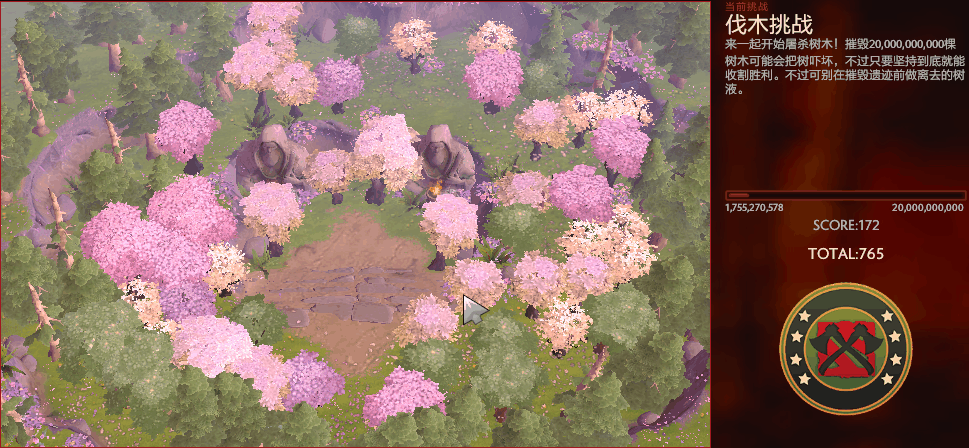

+++
title = "Dota2 伐木挑战自动砍树脚本"
date = 2016-05-21
description = "从旧脚本仓库和图床素材补迁移的一段 Dota2 伐木挑战自动点击脚本记录。"
draft = false

[taxonomies]
tags = ["Dota2", "Python", "脚本"]

[extra]
source = "py3_scripts + img"
source_files = ["py3_scripts:dota2_lumbering_challenge.py", "img:chopping.gif", "img:chopping_result.png"]
+++

下面是从旧脚本仓库恢复的核心代码和图床素材。脚本提交时间是 `2016-05-21`，对应提交信息为 `A automatic tool for Dota2's lumbering challenge`。



核心思路是监听键盘事件，在 `Ctrl+C` 之后，于固定屏幕区域内随机点击 `60` 秒。

```python
# -*- coding: UTF-8 -*-
__author__ = 'Yu Sun'

import random
import time
import win32api
from ctypes import *

import pyHook
import pythoncom
import win32con

# Set run time for this module (seconds)
run_time = 60


class POINT(Structure):
    _fields_ = [("x", c_ulong), ("y", c_ulong)]


def mouse_click(x=None, y=None):
    if not x is None and not y is None:
        mouse_move(x, y)
        time.sleep(random.random())
    win32api.mouse_event(win32con.MOUSEEVENTF_LEFTDOWN, 0, 0, 0, 0)
    win32api.mouse_event(win32con.MOUSEEVENTF_LEFTUP, 0, 0, 0, 0)


def mouse_move(x, y):
    windll.user32.SetCursorPos(x, y)


def onKeyboardEvent(event):
    event.WindowName = None
    # Ascii == 3 represent for "Ctrl+C" hotkey
    if event.Ascii == 3:
        start = time.clock()
        print("Start chopping!")
        while True:
            mouse_click(x=random.randint(198, 898), y=random.randint(178, 624))
            end = time.clock()
            if end - start > run_time:
                print("Time's up!")
                exit(0)
    return True


def main():
    # Set a hook manager
    hm = pyHook.HookManager()
    # Monitor all keyboard events
    hm.KeyDown = onKeyboardEvent
    # Set a keyboard hook
    hm.HookKeyboard()
    # Keep monitoring
    pythoncom.PumpMessages()


if __name__ == "__main__":
    main()
```


