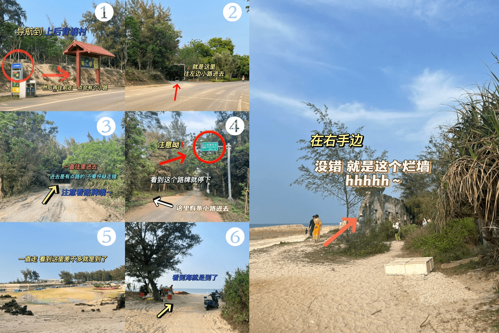

+++
title = "涠洲岛出行"
date = 2024-02-29
description = "我们一家跟随公司去涠洲岛旅行的大致计划和记录。"
draft = false

[taxonomies]
tags = ["旅行", "攻略"]

[extra]
source = "blog"
toc = true
+++
> **手机用户**建议安装*百度地图*app后使用浏览器访问，效果更佳。

## 固定时间表

### 去程（`3`月`1`日）

| 位置变化 | 时间 | 交通工具 | 班次 | 备注 |
|-|-|-|-|-|
| [公司 ➡ 机场（T2航站楼）](http://api.map.baidu.com/direction?origin=财智大厦&destination=广州白云国际机场-T2航站楼&mode=transit&region=广州&output=html&src=webapp.sctmes.travel) | 20:00 ➡ 21:10| 👣 + 🚇 | 地铁3号线北延段 | 步行和等车时间已计入 上车前请确认为**机场北**方向 无婴幼儿可顺延`0.5`-`1`小时 |
| 广州 ➡ 北海 | 23:10 ➡ 00:35 | 🛫 | 南航**CZ3353** | 身份证（出生医学证明） 行李 |

### 去程（`3`月`2`日）
| 位置变化 | 时间 | 交通工具 | 班次 | 备注 |
|-|-|-|-|-|
| [机场 ➡ 海乐宾馆](http://api.map.baidu.com/direction?origin=北海福成机场&destination=北海海乐宾馆&mode=driving&region=北海市&output=html&src=webapp.sctmes.travel) | 🤷 | 🚕 | - | 带齐行李物品 可开导航确保安全 |
| [海乐宾馆 ➡ 北海国际客运港](http://api.map.baidu.com/direction?origin=北海海乐宾馆&destination=北海国际客运港&mode=driving&region=北海市&output=html&src=webapp.sctmes.travel) | 8:30 ➡ 8:50 | 🚕 | - | 带齐行李物品 |
| 北海 ➡ 涠洲 | 9:20 ➡ 11:10 | *观光*🚢 | **北游15** **BW0007** | 晕船可坐**船尾**座位 |
| 涠洲岛西角码头 ➡ 艾尚日落海景酒店 | 🤷 | 酒店专车 | - | 带齐行李物品 [备用路线](http://api.map.baidu.com/direction?origin=北海市涠洲岛西角码头&destination=涠洲岛艾尚日落海景酒店&mode=driving&region=北海市&output=html&src=webapp.sctmes.travel) |

### 返程（`3`月`4`日）

| 位置变化 | 时间 | 交通工具 | 班次 | 备注 |
|-|-|-|-|-|
| 艾尚日落海景酒店 ➡ 涠洲岛西角码头 | 9:30 ➡ 9:50 | 酒店专车 | - | 带齐行李物品 [备用路线](http://api.map.baidu.com/direction?origin=涠洲岛艾尚日落海景酒店&destination=北海市涠洲岛西角码头&mode=driving&region=北海市&output=html&src=webapp.sctmes.travel) 酒店**含早** |
| 涠洲 ➡ 北海 | 10:20 ➡ 11:40 | *快速*🚢 | 🤷 | 晕船可坐**船尾**座位 |
| [北海国际客运港 ➡ 越乡小厨（老码头店）](http://api.map.baidu.com/direction?origin=北海国际客运港-3号门&destination=北海市越乡小厨(老码头店)&mode=walking&region=北海市&output=html&src=webapp.sctmes.travel)| 🤷 | 👣 | - | 需**提前定位** |
| [越乡小厨（老码头店） ➡ 北海站](http://api.map.baidu.com/direction?origin=北海市越乡小厨(老码头店)&destination=北海站-进站口&mode=driving&region=北海市&output=html&src=webapp.sctmes.travel) | 13:30 ➡ 13:50 | 🚕 | - | 1. 打印**报销凭证** 2. 过安检 3. 在**进站口**候车 |
| 北海 ➡ 广州 | 14:46 ➡ 19:59 | 🚝 | **D3724** | 需拿**报销凭证** |

## 干饭指南

### `3`月`2`日 早餐

**空腹**或**吃太饱**上船都极易加重晕船。建议派出家眷觅食并带回酒店，以下为一些精心挑选出来的可选铺子，涉及以下因素：

- **步行距离**（时间）：打车买早餐不确定性太大
- **开铺时间**：去码头需要尽量在8:30左右出发，太晚开铺的不考虑，带⚠️标记较为临界，请慎重考虑
- **口碑**：大众点评分数、评价以及是否上榜（不计*环境*和*服务*榜）

| 店名 | 菜品 | 往返时间（距离） | 开铺时间 | 是否上榜 |
|-|-|-|-|-|
| [侨越世家越南卷粉](http://api.map.baidu.com/direction?origin=北海海乐宾馆&destination=侨越世家越南卷粉&mode=walking&region=北海市&output=html&src=webapp.sctmes.travel) | 炸春卷 卷粉 虾饼 墨鱼丸 | `18`分钟（`550`米）| ⚠️08:00 | ❌ |
| [周记蟹仔粉](http://api.map.baidu.com/direction?origin=21.432081,109.128791&destination=21.429187,109.130952&mode=walking&region=北海市&output=html&src=webapp.sctmes.travel) | 海鲜/鱼丸蟹仔粉 越南春卷 墨鱼饼 | `18`分钟（`560`米）| 07:00 | ✔️ |
| [拾螺记桂柳螺蛳粉](http://api.map.baidu.com/direction?origin=北海海乐宾馆&destination=拾螺记桂柳螺蛳粉(侨港风情街店)&mode=walking&region=北海市&output=html&src=webapp.sctmes.travel) | 螺蛳粉 | `12`分钟（`380`米）| ⚠️08:00 | ❌ |
| [品越越南鸡粉牛骨汤粉](http://api.map.baidu.com/direction?origin=北海海乐宾馆&destination=品越越南鸡粉牛骨汤粉&mode=walking&region=北海市&output=html&src=webapp.sctmes.travel) | 什锦粉 牛腩粉 特色脆肉云吞 墨鱼饼 | `14`分钟（`420`米）| 07:00 | ✔️ |
| [费姐正宗蟹仔粉店](http://api.map.baidu.com/direction?origin=北海海乐宾馆&destination=费姐正宗蟹仔粉店&mode=walking&region=北海市&output=html&src=webapp.sctmes.travel) | 蟹仔粉 牛肉粉 | `12`分钟（`360`米）| 07:00 | ✔️ |

## 岛上推荐游玩路线
  
> 已做路线规划，建议在控制好时间的前提下按顺序游玩。

### `3`月`2`日 下午

> 从酒店出发，到日落后（晚饭前）。

#### 标志广场

| 路线 | 路程 | 游玩时间 | 备注 |
|-|-|-|-|
| [酒店 ➡ 标志广场](http://api.map.baidu.com/direction?origin=涠洲岛艾尚日落海景酒店&destination=刚哥深夜烧烤&mode=walking&region=北海市&output=html&src=webapp.sctmes.travel) | 约`4`分钟 | 约`20`分钟 | 打卡点 |

#### （可选）海上运动基地

| 路线 | 路程 | 游玩时间 | 备注 |
|-|-|-|-|
| [标志广场 ➡ 海上运动基地](http://api.map.baidu.com/direction?origin=刚哥深夜烧烤&destination=海上运动基地&mode=walking&region=北海市&output=html&src=webapp.sctmes.travel) | 约`4`分钟 | 🤷 | 打卡点 |

#### 天主教堂

| 路线 | 路程 | 游玩时间 | 备注 |
|-|-|-|-|
| [标志广场 ➡ 天主教堂](http://api.map.baidu.com/direction?origin=刚哥深夜烧烤&destination=涠洲盛塘天主教堂&mode=walking&region=北海市&output=html&src=webapp.sctmes.travel) | 约`31`分钟 | 约`30`分钟 | 打卡点 |

**拍照机位**：

- 后院木门
- 后院黄色走廊房子
- 拱形玫瑰铁门
- 玫瑰瀑布楼梯台阶

**建议着装**：浅色或者咖色的复古连衣裙

#### （建议晴天）仙人掌相框

| 路线 | 路程 | 游玩时间 | 备注 |
|-|-|-|-|
| [天主教堂 ➡ 上后背塘村](http://api.map.baidu.com/direction?origin=涠洲盛塘天主教堂&destination=上后背塘村-公交站&mode=walking&region=北海市&output=html&src=webapp.sctmes.travel) | 约`25`分钟 | 约`10`分钟 | 打卡点 |

#### （建议晴天）蓝桥

| 路线 | 路程 | 游玩时间 | 备注 |
|-|-|-|-|
| [上后背塘村 ➡ 蓝桥](http://api.map.baidu.com/direction?origin=上后背塘村-公交站&destination=蓝桥&mode=walking&region=北海市&output=html&src=webapp.sctmes.travel) | 约`7`分钟 | 约`20`分钟 | 打卡点 |

#### （日落）石螺口海滩

| 路线 | 路程 | 游玩时间 | 备注 |
|-|-|-|-|
| [蓝桥 ➡ 石螺口海滩](http://api.map.baidu.com/direction?origin=涠洲岛蓝桥&destination=石螺口海滩&mode=walking&region=北海市&output=html&src=webapp.sctmes.travel) | 约`30`分钟 | 约`30`分钟 | **18:48**日落 |

### `3`月`3`日

由于集体活动不确定，仅列举大概游览顺序：

1. （日出）贝壳沙滩景区：日出时间为**07:02**，但有`27`%的概率降雨
2. 火山公园
3. 仙人掌相框（二刷，看天气及前日完成度）
4. 蓝桥（二刷，看天气及前日完成度）
5. （日落）滴水丹屏：日落时间为**18:48**，作为*石螺口海滩*的替代日落景点

### `3`月`4`日

`4`日日出时间为**07:01**，气温明显回暖，降雨概率仅为`1`%，可考虑去五彩滩景区看日出：

| 路线 | 时间 |
|-|-|
| [酒店 ➡ 五彩滩景区](http://api.map.baidu.com/direction?origin=涠洲岛艾尚日落海景酒店&destination=五彩滩景区&mode=walking&region=北海市&output=html&src=webapp.sctmes.travel) | 06:30 ➡ 06:55 |
| [五彩滩景区 ➡ 酒店](http://api.map.baidu.com/direction?origin=五彩滩景区&destination=涠洲岛艾尚日落海景酒店&mode=walking&region=北海市&output=html&src=webapp.sctmes.travel) | 07:30 ➡ 07:55 |
