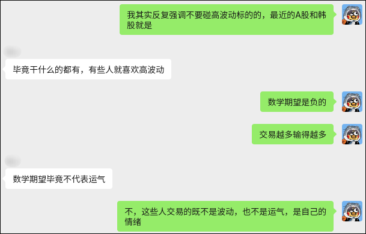
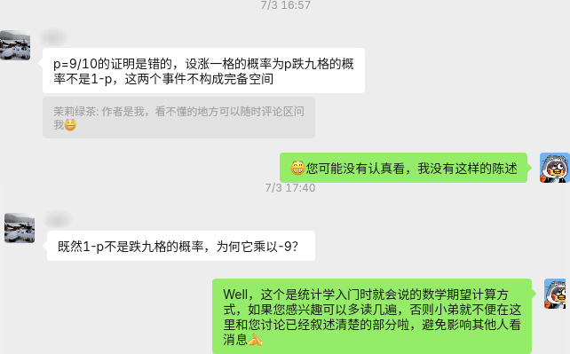
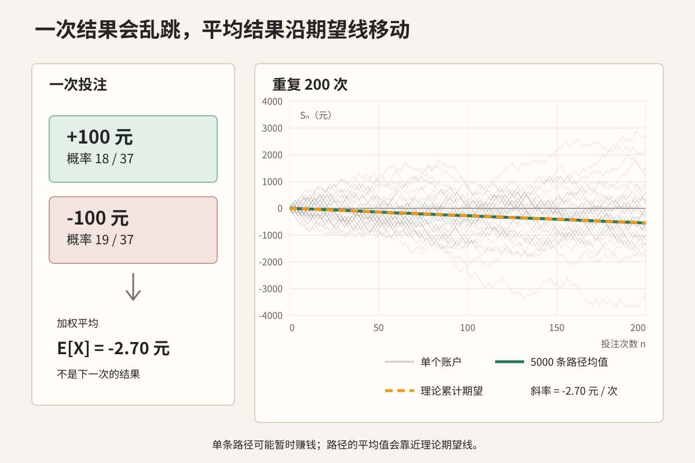
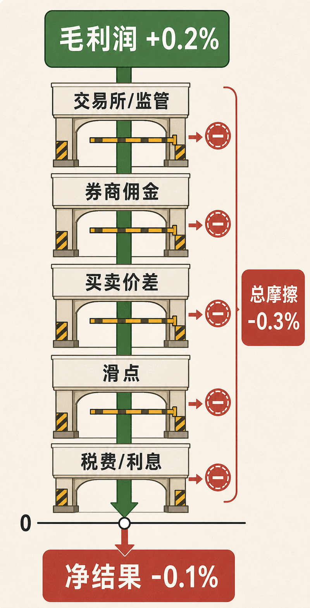
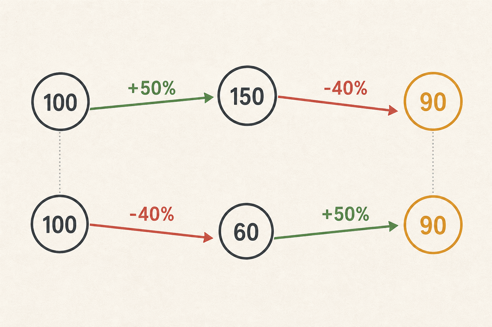

先谢谢 **邪ben** 的大额赞助，这为我的写作提供了充足动力。

邪ben 对先进的 harness engineering 展现出浓厚兴趣，为满足他的心愿，同时不背离我们做投资教育的主线，接下来几篇我会从**经济学与计算机技术结合的独特视角**聊聊我对：

- 存储
- 上下文管理
- harness engineering
- vibe coding

的理解。

不过这一篇先不追热点。我想先把一个更基础的问题讲清楚：数学期望。

## 聪明人也会被市场带偏

先看一段聊天，大概发生在两周前：

截图里被厚码的前辈，早年曾经慷慨解囊教会我很多东西，可以说是影响了我的人生轨迹。他是一位能力很强的研究型学者。

他当然懂概率。但到了市场里，连续几次交易碰巧赚钱，人还是可能把运气当能力，把“交易越多赚得越多”当成规律。

**研究做得好，不代表交易时就不会被自己的情绪骗。**

前阵子，我们的[第一篇文章](../grid-strategy-expected-value/index.md)发出去后，在群里我也看到类似的留言：

类似的反馈很多。问题都一样：大家乐于把一次结果、概率和数学期望混在一起。

为了彻底讲清楚这个问题，我们引入一个经典的菠菜小游戏作为例子：

## 先去轮盘桌上算一笔账

按照[现场欧洲轮盘规则](https://www.gaming.nv.gov/siteassets/content/divisions/enforcement/rules-of-play/Live_Roulette_Rules_of_Play.pdf)，欧洲轮盘有 37 个格子：18 个红色，18 个黑色，还有 1 个绿色的零。

假设每次押 100 元红色。开出红色，净赚 100 元；开出黑色或零，亏掉 100 元。规则里的红黑投注赔率是 1:1。

把一次押 100 元的净盈亏记作 X：

$$
E[X]
= \frac{18}{37}(100) + \frac{19}{37}(-100)
= -\frac{100}{37}
\approx -2.70\text{ 元}
$$

换成收益率，就是 -2.70%。所以，每押 100 元，重复很多次以后，**平均每次损失约 2.70 元**。

这不是说下一次一定亏 2.70 元。下一次只有两种结果：赚 100 元，或者亏 100 元。负 2.70 元是大量重复投注的平均结果，是赌场优势在长期里的表现。

次数怎样进入这笔账？

把第 i 次投注的净盈亏记作 X_i，前 n 次的累计盈亏记作：

$$
S_n = X_1 + X_2 + \cdots + X_n
$$

期望可以直接相加，所以：

$$
E[S_n]
= \sum_{i=1}^{n}E[X_i]
= n \times \left(-\frac{100}{37}\right)
\approx -2.70n\text{ 元}
$$

图里的灰线是单个账户可能走出的路径。它们会上下乱跳，有些账户押了 200 次仍然赚钱。绿线是 5000 条随机路径在每个时点的平均值，会贴近橙色的理论累计期望线。

从几何上看，橙线是一条斜率为 -2.70 元/次的直线：横轴每多走一次，纵轴上的累计期望就下降 2.70 元。你可以第一把赢，也可以连赢五把；短期结果不会改变这条线的方向。

**频率不会创造优势。它只会沿着原来就存在的期望，继续往前走。**

## 账户留下的，才是你真正赚到的

开户前，券商往往不遗余力宣传“限时免佣金”“0手续费”……真的开始交易后，App 也很愿意告诉你策略赚了多少。

而——至于为了完成这些交易付了多少钱，总是显示在细枝末节里，很多人忽略了这些**摩擦成本**。

假设一套方法在扣除成本前，每笔平均能赚 0.2%。这个数字是正的，但它只是毛利润。钱真正落到账户之前，还要经过几道收费关卡：

交易所和监管费用、券商佣金通常看得见。买卖价差和成交滑点则藏在成交价格里。做市商或其他流动性提供者可能赚取其中一部分价差；滑点还可能来自行情移动、市场深度不足，以及你自己的订单对价格造成的冲击。

> 关于什么是对手盘、什么是做市商、什么是滑点，及流动性的本质，我会在未来单独成文讲述。

使用杠杆时还有融资利息，做空时可能有融券费用；不同市场、账户和税务居民还可能承担适用税费。有些成本成交时立刻扣掉，有些会随着持仓时间慢慢累积。

美国金融业监管局（FINRA，一家受 SEC 监督、负责监管券商及其注册从业人员的非营利自律组织）[对线上交易的投资者提示](https://www.finra.org/investors/insights/questions-about-online-trading)也说明，零佣金不代表零成本，投资者仍会面对买卖价差等成本，而券商也可能通过其他方式获得收入。**零佣金，从来不等于零摩擦。**

把这张图写成公式，就是：

**净收益率 = 毛收益率 - 全部摩擦成本率**

在这个例子里：

$$
0.2\% - 0.3\% = -0.1\%
$$

扣完以后，期望已经从正数变成负数，不能再叫“少赚一点”。

佣金、价差、滑点和市场冲击会跟着成交反复发生；融资、融券和适用税费则按各自的规则另算。每天做二十笔，就比每天做一笔多付十九轮成交摩擦。

> **如果没有足以覆盖全部摩擦的优势，所谓“多做多赚”，往往只是多给券商、交易所、流动性提供者和税务机构贡献流水。**

## 市场不是固定赔率的轮盘

轮盘的格子、赔率和赌场优势都写在规则里。只要规则不变，每押一次红色，期望就是固定的 -2.70 元。

**真实情况更为复杂**：市场没有这样一张固定赔率表。每笔交易的净期望，都是根据当时的价格、信息、流动性和交易成本作出的估计。条件变了，期望也会变。不能因为过去十笔平均赚钱，就直接把这个数字乘到未来一百笔上。

期望相加本身不要求每笔交易彼此独立，但相关性决定了风险能不能分散。看似不同的十笔交易，可能都押在同一个风险因子上；一旦这个因子反转，十笔会一起亏，而不是互相抵消。

策略也有容量。参与者变多以后，原来的优势可能很快消失；下单越大，市场冲击越高；波动放大时，价差和滑点也会恶化。原本的正期望，可能在你真正成交时已经不存在了。

交易越频繁，临时改规则、追涨杀跌和过度自信的机会也越多。

每次下单前都该问：

> 这笔交易扣完所有成本后还有优势吗？这份优势还能维持多久？

## 正期望之后，还要谈仓位

到这里，交易频率这条线已经讲完了。接下来是另一个经常被混在一起的问题：**仓位**。

仓位决定一次涨跌会把整个账户推多远。即使交易本身的算术期望为正，仓位过大，也可能让同一个账户在反复复投中缩水。

先看一个故意夸张的例子。假设某个标的扣完摩擦成本后的结果只有两种：

- 50% 的概率赚 50%；
- 50% 的概率亏 40%。

单笔算术期望是：

$$
E[R]
= \frac{1}{2}(50\%) + \frac{1}{2}(-40\%)
= 5\%
$$

这个 5% 没算错。

假如有很多个本金都是 100 元的账户，各自全仓只做一次交易，大约一半会变成 150 元，另一半会变成 60 元，平均就是 105 元。

但这 105 元回答的是“许多账户各做一次，最后平均剩多少”。仓位问题问的是另一件事：“同一个账户连续做下去，会怎样？”

如果每次都全仓，上一笔剩多少，下一笔就拿多少继续做。假设每次结果相互独立，交易做得足够多以后，赚钱和亏钱的次数会逐渐接近各一半。每出现一次上涨 50% 和一次下跌 40% 的组合，本金就会乘以：

$$
1.5 \times 0.6 = 0.9
$$

也就是缩水 10%。

从 100 元开始，先赚后亏会走成 100 → 150 → 90；先亏后赚则是 100 → 60 → 90。顺序不同，终点相同。

涨跌百分比作用在不同的本金上。100 元亏 40% 后只剩 60 元；要从 60 元回到 100 元，需要赚 40 元，也就是上涨约 66.7%，而不是上涨 40%。

算术期望没有算错，账户缩水也不是悖论。前者把很多种结果相加后求平均；后者记录一笔资金在乘法复投中实际走过的路径。少数连续大赚的账户可以把总体平均值拉高，却不能替其他已经大幅回撤的账户继续下注。

如果每次只拿账户的 10% 去做同一笔交易，其余资金不动，那么这笔交易对整个账户的影响就从 +50% / -40% 缩小成 +5% / -4%。同样经历一赚一亏，账户会从 100 元变成：

$$
100 \times 1.05 \times 0.96 = 100.8
$$

交易本身、胜负概率和单笔标的收益都没变，只有仓位变了，账户路径就从缩水 10% 变成增长 0.8%。

**有正净期望，只说明这件事值得研究；押多大，决定你能不能活着等到优势兑现。**

> 有关仓位、建仓/开仓技巧，我在未来也会单独成文讲述。

## 你本不需要做那么多次交易

看到这里，你可能已经彻底读懂了数学期望在交易中的意义。

但**知行合一**是一个永恒的难题。最容易让人忘掉前面这笔账的，恰恰是**高波动**：价格一天来回几次，盘面上到处都像是可以下手的位置，于是“有波动”很容易被误读成“有机会”。

**波动只说明价格变化得大，不说明你在哪个方向上更有优势。** 一个没有信息优势、又喜欢频繁择时的普通交易者，可能在多空两边反复追价、止损、付价差、吃滑点，再叠加融资利息、融券费用和适用税费。这些行为足以把两边都做成负净期望。

接下来，我会讲讲最近半年被AI带火的**存储**板块。长鑫科技上市首日暴涨465.82%，我相信很多朋友又“摁不住自己的手”了。

下一篇 **《我为什么不建议你买存储》**，敬请期待。
