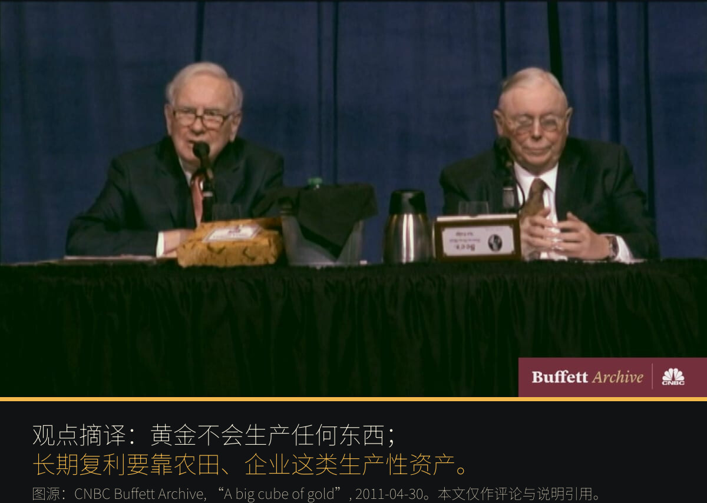
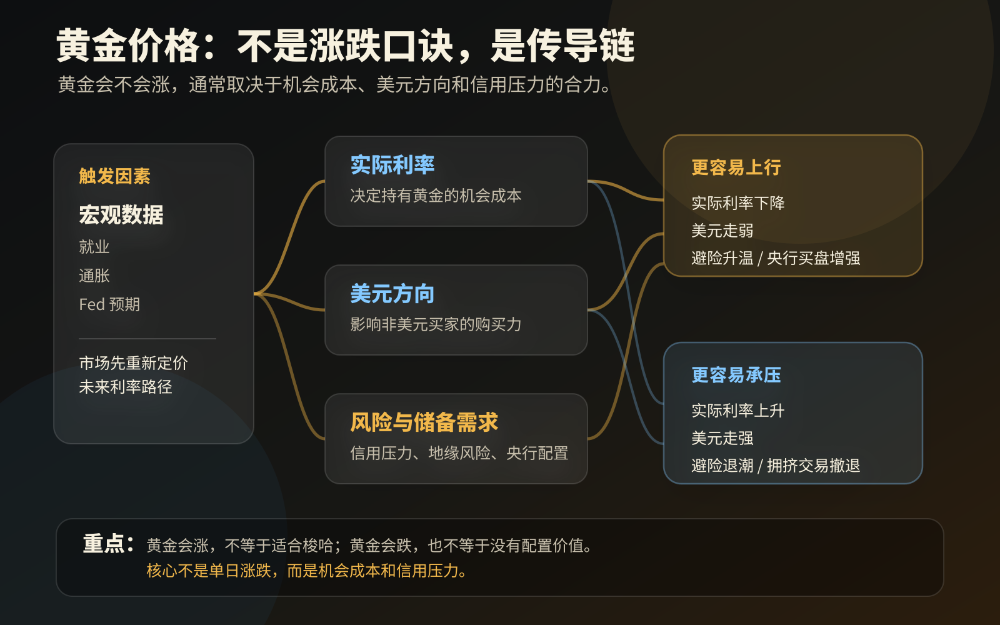

这一期废话少说，让我们直接有请新受害人：


提问的是我的大学同班同学。截图里其实包含了两个问题：

- 黄金后面还有没有下跌风险？
- 能不能趁这个阶段大笔买入、博弈高收益？

这不是简单的买点问题。真正重要的是，她为什么会在这个时间点，把“已有黄金持仓”进一步推演成“大笔加仓”。

背景是这样的：

她本来就有一部分黄金持仓。最近一次美国非农数据公布后，市场情绪明显变了。[BLS 公布的 2026 年 6 月就业数据](https://www.bls.gov/news.release/empsit.nr0.htm)显示，美国非农新增就业只有 5.7 万，失业率为 4.2%，同时 4 月和 5 月新增就业合计下修 7.4 万。

对黄金来说，这就是一个很直接的催化：就业数据弱于预期，市场下调对 Fed 继续加息的押注，实际利率压力缓和，美元走弱预期升温，避险和配置资金重新流入。[Anadolu 当天的市场报道](https://www.aa.com.tr/en/economy/gold-prices-jump-25-as-weak-us-jobs-data-cools-fed-hike-bets/3984510)也把黄金约 2.5% 的反弹和弱就业数据联系在一起。

于是，她手里的黄金持仓涨了不少。

这才是问题的起点：她不是从零开始研究黄金的资产属性，而是先被一段浮盈刺激到了。持仓涨得越明显，人越容易把“我这次赚到了”理解成“我看懂了”；再往前一步，就会从配置变成投机，从底仓变成重仓。

我当时回了一句：

> 黄金在任何时候都不建议大笔投入，只适合作为底仓。

这句话听起来保守，但背后其实是黄金这种资产最重要的使用说明。

黄金可以买，也值得很多人认真考虑。但它不适合在你看到一波反弹、手里浮盈变大、情绪开始上头的时候，被拿来大笔梭哈。

因为黄金不是 ~~财富发动机~~。

它更像一种**有机会成本的组合保险**。

## 黄金到底是什么资产

**黄金不是股票。**

股票背后是公司。公司可以卖产品、赚利润、扩产能、分红、回购。你买股票，理论上买的是未来现金流的一部分。

**黄金也不是债券。**

债券背后是债务人。你买债券，理论上买的是未来一串利息和本金偿还。当然，债务人可能违约，利率也会变化，但债券至少有一套现金流逻辑。

黄金没有这些东西。

一块黄金放在那里，十年后还是那块黄金。它不会自己变出利息，不会自己扩产，不会给你分红，也不会因为管理层很努力就提高 ROE。

所以黄金最容易让人误解的地方就在这里：**它很重要，但它不生产。**

这也是为什么我不建议普通投资者大笔投入黄金。你把太多资产放进黄金，本质上是在放弃一大块生产性资产的长期复利机会。

但反过来说，黄金也有别的资产很难替代的特征。

[World Gold Council](https://www.gold.org/goldhub/research/relevance-of-gold-as-a-strategic-asset) 对黄金的描述很直白：黄金是高流动性的资产，不是任何人的负债，没有信用风险，而且稀缺。它的需求来源也很分散，既有投资需求，也有央行储备、珠宝和技术用途。

这句话翻译成普通人能听懂的话，就是：

> 黄金不靠某个公司赚钱，不靠某个债务人还钱，也不靠某个国家一定守信用。

*这正是它的缺点，也是它的优点。*

## 难道巴菲特错了？

讲黄金，绕不开巴菲特。

巴菲特不喜欢黄金，这件事很多人都知道。他最经典的论证来自 [Berkshire Hathaway 2011 年股东信](https://www.berkshirehathaway.com/letters/2011ltr.pdf)。[CNBC Buffett Archive](https://buffett.cnbc.com/video/2011/04/30/buffett-on-a-big-cube-of-gold.html) 里也有一段 “A big cube of gold” 视频，讲的正是这个意思。



他的意思大概是：如果把全世界黄金熔成一个巨大的金块，这个金块本身不会生产任何东西。用同样的钱，你可以买美国大量农田，再加上一堆像 ExxonMobil 那样会赚钱的公司。过了一百年，农田产过很多粮食，公司赚过很多利润，黄金还是那块黄金。

这个反方观点非常强。

而且我认为巴菲特基本是对的。

如果你的问题是：

> 什么资产最适合长期创造财富？

黄金大概率不是好答案。

长期财富创造主要依赖生产性资产。企业把资本投入生产，产生利润，再把利润继续投入更高回报的地方，这才是复利的主发动机。

黄金没有这个机制。

但如果你的问题换一下：

> 我的组合里要不要留一部分资产，用来对冲货币信用、地缘风险和金融系统压力？

黄金就值得讨论。

所以，**巴菲特没有错。错的是把巴菲特的结论用错场景。**

黄金不适合承担“让我长期变富”的主任务。

黄金更适合承担“市场出问题时，我不要死得太难看”的副任务。

**理解巴菲特为什么不买黄金，你就不会大笔梭哈；理解黄金为什么仍然有用，你也不会完全不持有。**

## 黄金价格的传导链

黄金的涨跌不用分成两套故事。它本质上是在交易几条传导链的合力。



**第一条是实际利率。**

黄金不付息，所以它天然有机会成本。当真实利率很高时，现金、货币基金、短债这些低风险资产就能给你不错收益，黄金的吸引力会下降。反过来，当市场认为 Fed 加息概率下降、未来真实利率压力缓和时，黄金就更容易被重新定价。[PIMCO 在讨论黄金价格时](https://www.pimco.com/us/en/resources/education/understanding-gold-prices)也强调过，真实收益率会影响持有黄金的机会成本。

**第二条是美元。**

黄金通常以美元计价。美元走弱时，非美元买家买黄金的压力会下降，黄金更容易得到支撑；美元重新走强时，这条链条就会反过来压制黄金。

**第三条是风险和储备需求。**

战争、金融系统压力、主权信用问题、货币信用受损，会让资金去找“不依赖某个对手方承诺”的资产。央行买黄金，也不是因为央行每天盯着 K 线炒短线，而是因为黄金在储备里有特殊位置：它不依赖另一个国家的债务信用，也可以在压力时期提供流动性。

所以，黄金不是简单的**“抗通胀按钮”**。

通胀高，但央行更鹰、真实利率上升，黄金未必舒服。通胀不高，但市场开始怀疑财政纪律、货币信用或金融系统稳定性，黄金反而可能表现很强。

我更愿意这样理解黄金：

> 黄金对冲的不是某一个经济指标，而是对信用体系的不信任；黄金交易的也不是一个单独变量，而是**机会成本和信用压力的合力**。

这也是为什么它适合作为底仓，而不是作为梭哈仓。

底仓的意思不是“我觉得它明天会涨”。

底仓的意思是“我承认有些风险无法精确预测，所以我愿意长期为这部分风险付一点机会成本”。

## 底仓不是永远不卖

很多人一听“底仓”，就理解成永远不动。

这也不对。

**底仓不是牌位，不能供起来。**

黄金作为底仓，一个很重要的功能是在特殊时期换取流动性。

今年三四月的土耳其央行就是一个很好的例子。公开报道显示，土耳其央行在市场压力和里拉承压时，动用了黄金储备和黄金互换来获得美元流动性、支持本币；压力缓和后，又开始恢复一部分黄金储备。[Turkish Minute](https://www.turkishminute.com/2026/04/08/turkey-spends-billions-in-reserves-to-support-lira-amid-iran-war-turmoil/) 和 [Kitco](https://www.kitco.com/news/article/2026-04-28/turkish-central-bank-boosts-gold-reserves-364-tonnes-two-weeks-it-closes) 都报道过这一轮黄金储备下降、互换以及后续回补的过程。

央行为什么要这样做？

因为储备资产不是拿来摆好看的。真遇到压力时，它要能变成流动性。

个人账户当然不是央行。你没有汇率保卫战，也不会拿黄金去做国际互换。但逻辑可以类比。

比如：

- 工作现金流突然中断，需要撑过一段时间；
- 市场暴跌，优质资产被错杀，你需要现金去接；
- 家庭突然出现大额支出，不能被迫卖掉更核心的长期资产；
- 杠杆、保证金或债务压力逼近，你必须先活下来。

这些时候，黄金底仓的意义就不是“它涨了多少”，而是：

> 它能不能在压力环境里，帮你把时间买回来？

这和大笔梭哈是完全相反的思路。

梭哈黄金，是把黄金变成一个**方向性赌注**。

持有黄金底仓，是承认未来有不确定性，所以给自己留一块可以换成流动性的缓冲垫。

一个是赌行情。

一个是买生存空间。

## 普通人怎样使用黄金

普通投资者看黄金，最重要的是先别问“还能不能涨”。

先问三个更基础的问题：

```text
我买黄金，是为了赚钱，还是为了降低组合脆弱性？
如果黄金一年不涨，我能不能接受它占用资金？
如果其他资产暴跌，我是否愿意卖出一部分黄金去换流动性？
```

如果你的答案是“我就想靠它这个月回血”，那黄金不适合你。

不是黄金不好，而是你在让它承担**错误的任务**。

如果你的答案是“我希望组合里有一块资产，不依赖公司盈利、不依赖债务人还款、不完全依赖风险资产上涨”，那黄金才进入讨论范围。

但即便如此，也不代表要大笔投入。

黄金更适合小比例、长期、纪律化地持有。它应该是组合里的**缓冲层**，不是组合里的主发动机。

说得直一点：

> 股票和生产性资产负责让你变富，黄金负责让你在某些坏时候不那么被动。

**你不能因为安全气囊有用，就把整辆车都改成安全气囊。**


反过来，有几种情况反而应该先冷静。

刚看到别人赚钱时，你买的往往不是黄金，而是*别人的收益截图*。

自己刚亏钱时，你买的往往不是黄金，而是*安全感*。

短期宏观数据刚刺激一波上涨时，也不要把解释涨幅的原因，直接偷换成“大笔投入”的理由。比如这次非农走弱后黄金反弹，它可以解释为什么黄金涨，但不能自动推出“所以现在应该梭哈”。

最危险的时刻，不一定是黄金下跌的时候。

很多时候，反而是它刚刚证明你“好像买对了”的时候。

因为浮盈会让人产生一种错觉：

> 我不是运气好，我是看懂了。

然后仓位就开始变形。

## 结尾

黄金不是废铁，也不是 ~~圣杯~~。

它不创造现金流，不适合作为长期财富增长的主引擎。

但它也不是毫无价值。它有稀缺性，有全球流动性，没有信用风险，在某些压力情景下能提供组合缓冲。

所以我对黄金的态度很简单：

> 可以有，但不要上头。
> 可以做底仓，但不要梭哈。
> 可以在关键时刻卖出换流动性，但不要把短期浮盈当成永恒信仰。

看完这篇文章，从未有黄金持仓的你，也许会开始考虑建立一部分底仓。

那接下来的问题就来了：

标的选哪个？

如果准备从零建立黄金底仓，应该一次买完，还是分批建仓？

黄金在账户里到底应该占多少比例？

上涨很多之后，要不要减仓？

下跌很多之后，要不要补？

这些问题，我们后面继续写。

如果你还有其他感兴趣的投资教育主题，也欢迎直接回复提出。
