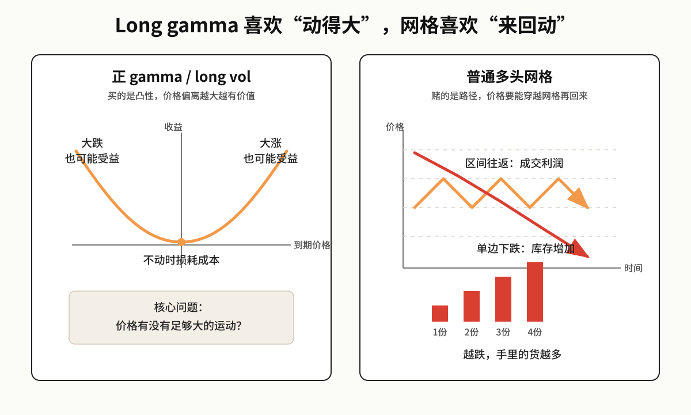
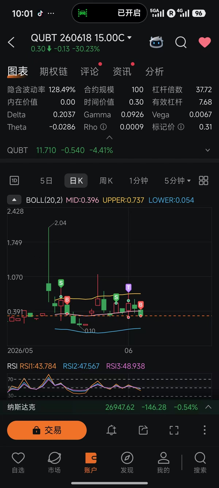

有个微信群里的朋友，数学出身，前阵子迷上了券商 App 里自带的“网格策略”。

一开始，他确实赚到了一点钱。价格跌一格，系统买入；价格涨一格，系统卖出。App 每天都能弹出几笔“网格收益”，看起来像一台不知疲倦的自动取款机。

但有个前提不能跳过：他选的是一只典型的“老登股”。

那段时间 AI 是明牌主线，资金注意力和风险偏好都在往 AI 相关资产集中。他选的标的没有这个叙事，增长弹性弱，市场关注度低，流动性也在被主线抽走。也就是说，这个标的本身就不在当下市场愿意交易的方向上。

然后它开始阴跌。

网格继续工作，仓位越买越多，浮亏越来越大。几次小反弹贡献的网格利润，完全盖不住底仓和新增仓位的亏损。但他还是觉得这个策略有用，只是“最近行情不好”，甚至说：等股价稳定了，我再开起来。

群聊里的状态，大概就是这样：


看到这句，我第一反应不是“这个人不懂数学”。恰恰相反，问题的典型性就在这里：一个学过数学的人，也会被交易软件制造出来的局部正反馈带偏。

问题不在于“网格策略一定不能用”，而在于很多人根本没有理解自己在交易什么风险。他们把 App 展示的已实现小利润，当成了策略有正期望的证据。

## 把话说在前面

网格策略不是圣杯。

更准确地说：

- 它赚的是区间内的往返波动。
- 它亏的是单边趋势里的库存风险。
- 它看起来像“做多波动率”，但并不是金融意义上真正的 long volatility。
- 高频的小额盈利，不能证明策略的数学期望为正。
- 如果标的没有均值回归，网格只是一个自动加仓系统。
- 如果标的本身偏离交易主线，网格不能替你解决流动性折价。

我对这种策略的定义更简单：

> 网格策略不是在消灭风险，而是在把方向性风险延后确认。

它把趋势判断错误造成的亏损暂时留在未卖出的库存仓位里，同时用小额已实现利润制造“策略仍在赚钱”的错觉。

## 标的先错了，参数救不了

很多人讨论网格，一上来就问参数：网格间距多少？每格买多少？区间怎么设？

这些当然重要，但不是第一问题。

先问：你为什么要对这个标的做网格？

市场不是一锅均匀搅拌的随机数。不同资产的流动性、关注度、估值锚和交易主题都不一样。同样是下跌 10%，AI 主线里的强势票、宽基指数、夕阳行业里的边缘公司，背后的资金结构不是一回事。

这个案例的问题就在这。他买的是“老登股”：故事旧，弹性弱，不在市场愿意定价的主线上。AI 交易越热，资金越愿意为算力、模型、应用、数据中心这些方向付溢价，非主线资产就越容易被边缘化。

网格需要价格“有来有回”。但如果一个标的正在失去交易关注，路径经常不是有来有回，而是：

```text
下跌时有卖盘
反弹时没买盘
偶尔弹一下
然后继续磨
```

这种路径对网格非常差。你以为自己在收割波动，实际上是在给一个流动性变差、叙事变弱的资产持续提供买盘。

说难听点：你是想做网格，还是想一路加仓加到进股东名册？

## 网格到底在交易什么

先别急着看公式，先看一个很小的模拟。

假设价格每跌 1 元买 1 份，每涨回 1 元卖 1 份。

| 价格 | 网格动作 | 手里还剩的货 | 已实现网格利润 | 未实现盈亏 |
| ---: | --- | ---: | ---: | ---: |
| 100 | 开始观察 | 0 份 | 0 | 0 |
| 99 | 买 1 份 | 1 份 | 0 | 0 |
| 98 | 买 1 份 | 2 份 | 0 | -1 |
| 99 | 卖 1 份 | 1 份 | +1 | 0 |
| 98 | 买 1 份 | 2 份 | +1 | -1 |
| 97 | 买 1 份 | 3 份 | +1 | -3 |
| 96 | 买 1 份 | 4 份 | +1 | -6 |
| 95 | 买 1 份 | 5 份 | +1 | -10 |

这里的未实现盈亏，是按当前价格把手里还没卖出的货逐笔标记出来，不计手续费和滑点。

坑也正在这里。

价格从 98 反弹到 99 的时候，系统确实完成了一笔低买高卖。App 可以告诉你：恭喜，赚了 1 元。

但整个账户发生了什么？

你从空仓，变成手里拿着 5 份货，而且现价已经跌到 95。App 里最醒目的数字可能还是“已实现网格利润 +1”，但库存上的未实现亏损已经是 -10。合起来看，账户其实是 -9，还没算交易成本。

麻烦不在于“刚才那一格有没有赚钱”，而在于：价格每往下走一步，你手里的货也在变多。后面再跌，每一格都不是 1 份在亏，而是好几份一起亏。

网格在阴跌里最麻烦的地方就在这里：它不是单纯“越跌越便宜”，而是“越跌，你押上去的东西越多”。

把这个过程写成规则，就是：

1. 价格每下跌一格，买入一份。
2. 价格每上涨一格，卖出一份。
3. 每一格的间距是 $h$。
4. 每次交易数量是 $q$。

于是，每完成一次“低买高卖”，账面上就会出现一笔网格利润：

$$
\text{grid profit} = qh
$$

这也是券商 App 最喜欢展示的东西：今天完成了几格，赚了多少钱。

但真实盈亏不是这一项。完整账应该这样写：

```text
真实盈亏
= 已完成网格价差
+ 未卖出库存的浮动盈亏
- 手续费
- 滑点
- 资金占用成本
```

最容易犯的错，就是只看第一行。

网格完成一笔交易，当然会产生一个确定的小利润。但只要你手里还有库存，整个策略就仍然绑在标的价格上。价格继续下跌时，库存亏损会吞掉前面很多次“小胜利”。

你看到的是成交利润；你没认真看的，是手里那堆还没卖出去的货。

如果这个库存还是一只正在失去市场主线位置的老登股，问题会更糟。因为你不只是承担价格波动，还在承担流动性和叙事折价。

## 它是做多波动率吗？

很多人会问：网格低买高卖，价格波动越多，成交越多，那它的本质是不是做多波动率？

答案是：**像，但不等于。**

这里借一点期权语言，不是为了堆术语，而是为了划清一个关键区别：正 gamma 喜欢“动得大”，普通网格喜欢“来回动”。



它确实喜欢价格在区间内来回波动。如果价格不断穿越你的网格线，又总能回到原来的区域，网格会持续完成买卖，并把波动转化成成交利润。

从这个意义上说，网格在吃“往返波动”。

真正的做多波动率，典型形式是买入期权或持有正 gamma 头寸。它的核心特征是：标的价格大幅运动时，策略本身具有凸性收益，亏损通常由期权权利金限定。

普通网格没有这种结构。

普通网格在下跌时不断买入，在上涨时不断卖出。它不是一个亏损有限、收益凸性的 long vol 头寸，而是一个带有仓位库存的均值回归策略。

如果说得更技术一点：真正的 long vol 依赖凸性，价格越剧烈偏离，正 gamma 带来的收益越明显；普通网格依赖路径，只有价格反复穿越网格线并回到区间内，才会把波动兑现成利润。

前者买的是凸性，后者赌的是往返。

我会这样表述：

> 网格策略做多的是区间内的往返波动，做空的是单边趋势。

如果价格横盘震荡，它像是在“吃波动率”。  
如果价格一路阴跌，它就变成“自动补仓”。  
如果价格一路上涨，它又会过早卖飞仓位。

所以网格真正依赖的，不是“有波动”这么简单，而是一个更强的假设：

> 标的价格会在你设定的区间内均值回归。

如果这个假设不成立，网格没有任何神秘优势。

## 90% 胜率也可以是 0 期望

网格最会骗人的地方，是胜率看起来很高。

比如你买入之后，只要上涨一格就止盈；如果一路下跌，最多跌 9 格之后才认输。你会发现，这种交易的胜率看起来可以很高。

看一个最小模型。

这个模型不是完整的网格策略，只是把“一次小赚、一次大亏”的结构抽出来，说明一件事：高胜率本身不能证明正期望。

假设价格每次只会随机上涨一格或下跌一格，而且上涨、下跌概率都是 50%。这就是一个没有方向优势的公平随机游走。

你在当前位置买入：

- 上涨 1 格，盈利 $+h$。
- 下跌 9 格，亏损 $-9h$。

这笔交易的胜率是多少？

在公平随机游走中，从 0 出发，先碰到 $+1$ 而不是先碰到 $-9$ 的概率是：

$$
P(\text{win}) = \frac{9}{10}
$$

也就是 90%。

这个概率不是拍脑袋来的。对称随机游走从 0 出发，上边界是 $+a$、下边界是 $-b$ 时，先碰到上边界的概率是：

$$
\frac{b}{a+b}
$$

这里 $a=1$、$b=9$，所以胜率是 $9/(1+9)$。

如果想看推导，可以这样理解。设价格位置为 $X_t$，从 $X_0=0$ 出发；设 $\tau$ 是价格第一次碰到 $+1$ 或 $-9$ 的时间。公平随机游走没有方向优势，所以停在边界时的期望位置仍然是 0：

$$
E[X_\tau] = 0
$$

如果赢的概率是 $p$，那么：

$$
p \times 1 + (1-p) \times (-9) = 0
$$

解出来就是：

$$
p = \frac{9}{10}
$$

听起来很厉害。但数学期望是多少？

$$
E
= 0.9 \times h + 0.1 \times (-9h)
= 0
$$

所以，单看胜率很容易被骗：

> 高胜率不等于正期望。

90% 的时候赚 1 份，10% 的时候亏 9 份，在不考虑手续费时，数学期望刚好是 0。考虑手续费、滑点、融资成本之后，期望就是负的。

这不是在说“所有网格策略都等于 0 期望”。它证明的是更基础的一点：高胜率可以只是亏损尾巴被延后了，并不代表你有优势。

网格会制造大量“小赚一次”的记录，让你感觉策略很稳定。但如果每一轮小赚背后，都伴随着一次可能很大的库存亏损，那么高胜率只是表象。

该问的不是“这次网格有没有成交赚钱”，而是：

```text
每承担一单位库存风险，我能得到多少补偿？
这个补偿扣除交易成本后，数学期望是否仍然为正？
```

如果你回答不了，策略就没有被证明。

## 阴跌为什么会杀死网格

现在看最常见的场景：标的一路阴跌。

假设初始价格是 $P_0$，网格间距是 $h$，每跌一格买入 $q$ 份。价格连续下跌 $K$ 格，买入价格依次是：

$$
P_0-h,\ P_0-2h,\ P_0-3h,\ \ldots,\ P_0-Kh
$$

如果当前价格停在 $P_0-Kh$，前面买入的仓位全部处于浮亏状态。

这些库存亏损在这个简化路径里可以逐笔算出来：

- 第一份买在 $P_0-h$，现价是 $P_0-Kh$，亏 $(K-1)h$。
- 第二份买在 $P_0-2h$，亏 $(K-2)h$。
- 越往后买，单份浮亏越小。
- 最后一份买在 $P_0-Kh$，刚好是当前价，浮亏是 0。

所以库存浮亏是：

$$
qh \times [0 + 1 + 2 + \cdots + (K-1)]
= qh \times \frac{K(K-1)}{2}
$$

这里还没算手续费、滑点和资金占用成本。

注意这里的增长速度。

网格利润通常是一格一格线性累积；但单边下跌时，库存亏损会随着 $K(K-1)/2$ 增长，近似是平方级。

简单看一个表：

| 连续下跌格数 $K$ | 累计买入份数 | 库存浮亏（单位：$qh$） |
| ---: | ---: | ---: |
| 3 | 3 | 3 |
| 5 | 5 | 10 |
| 10 | 10 | 45 |
| 20 | 20 | 190 |

下跌 20 格，不是亏 20 个单位，而是亏 190 个单位的库存差额。

所以很多人会一边看到 App 里有“累计网格利润”，一边看到账户净值越来越难看。

你赚的是一格一格的小钱；你亏的是越来越重的库存。

## “等股价稳定了再开”为什么危险

“等股价稳定了，我再开网格。”

这句话听起来很理性，其实经常只是事后归因。

因为所谓“稳定”，很多时候只有事后才知道。你今天看到的横盘，可能是企稳，也可能只是下一轮下跌前的中继。

对老登股尤其如此。它看起来“稳定”，有时只是因为没人交易了，成交缩了，波动暂时变小了。这种稳定不一定代表风险消失，反而可能代表市场注意力已经离开。

如果你没有能力回答下面这些问题，“稳定了再开”就没有实质意义：

- 为什么这个价格区间合理？
- 标的是否有基本面价值锚？
- 这家公司、ETF 或资产是否真的具有均值回归特征？
- 它是否仍在当前市场的交易主题里？
- 跌破区间后，是停止、止损，还是继续加仓？
- 单个标的最大仓位是多少？
- 网格利润能否覆盖手续费、滑点和资金成本？

没有这些条件，所谓“等稳定了再开”，多半只是：

> 我希望它不要再跌了。

但希望不是交易系统。

再说直一点：这时你交易的已经不是逻辑，而是不甘心认错的情绪。你不是看见了新的机会，只是在等旧仓位给你一次翻身的机会。

## 什么情况下网格可以讨论

我不是要说网格一定不能用。

网格可以是一种工具，但它只适合在非常明确的约束下使用。比如：

| 条件 | 含义 |
| --- | --- |
| 标的有价值锚 | 你能解释为什么它不应该无限下跌 |
| 交易主题不背离 | 资金和关注度没有系统性离开 |
| 区间有依据 | 上下界不是拍脑袋设出来的 |
| 仓位有上限 | 不允许策略无限补仓 |
| 跌破区间有规则 | 事前定义停止、止损或重估 |
| 成本足够低 | 网格间距显著大于手续费和滑点 |
| 接受卖飞 | 上涨趋势中可能提前卖出 |

我自己也会做类似的库存交易，但第一步不是开策略，而是先问：这个标的值不值得我拿库存？

比如这张图，是我当时持有 100 股 QUBT 正股，同时卖 covered call 收权利金的例子：



Covered Call 不是网格。它有短 call 的 theta、gamma、vega 等期权暴露，不能简单等同于“开网格”。但如果先撇开短腿上的希腊字母，只看底层逻辑，它和多头网格有一个共同点：你都先拿着一部分库存，再试图从价格反复波动中获得补偿。

关键仍然落在标的和路径上。

我当时选择 QUBT，不是因为它一定会涨，而是因为我能解释为什么它可能适合这种库存型交易：

- 它处在量子计算/量子光子这个主题里。[Quantum Computing Inc.](https://www.quantumcomputinginc.com/) 对自己的定位也是 integrated photonics 和 quantum optics 相关技术公司，而不是一个完全没有产业叙事的壳。
- 量子计算当时不是 AI 主线里最拥挤的方向，但它和高风险科技股的风险偏好相连。如果科技股继续 risk-on，资金有机会外溢到量子板块。
- 当时宏观环境在“美伊和谈、破裂、再和谈”的噪音里反复切换，市场一会儿愿意追科技风险资产，一会儿又开始恐慌。对我来说，这意味着板块可能不是单边趋势，而是反复进出。

所以我不太担心 covered call 被过早 call 走：如果它真的快速涨到我的行权价以上，那本来就是我愿意交货的价格；如果它只是随着风险偏好来回抽动，权利金就是对这段波动和库存风险的补偿。

到这一步，网格或类似库存策略才值得讨论：你不是因为 App 给了一个按钮才交易，而是因为你能解释这个标的为什么适合承接库存，为什么可能出现来回波动，以及如果判断错了应该怎么退出。

如果你不能接受这些约束，那你喜欢的可能不是网格策略，而是 App 给你的即时正反馈。

## 工具不是优势

我真正反对的不是网格，而是把工具误认为优势。

网格不会把老登股变成 AI 主线，也不会把趋势下跌变成均值回归。它只是一个自动执行的库存规则：标的选错、区间设错、仓位没上限，它就会更有纪律地帮你犯错。

小赚很多次，不等于长期赚钱。策略自动运行，也不等于风险自动消失。

所以，网格最该被记住的一句话是：

> 它不是圣杯，只是一个自动按钮。按下去之前，你要先知道自己愿不愿意接这批货。

本文仅用于投资教育，不构成任何投资建议。
