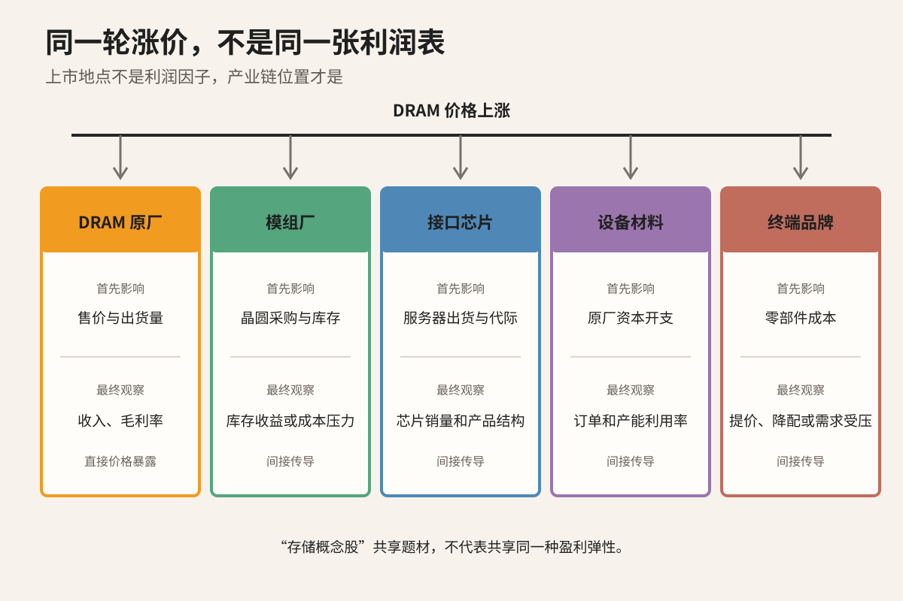
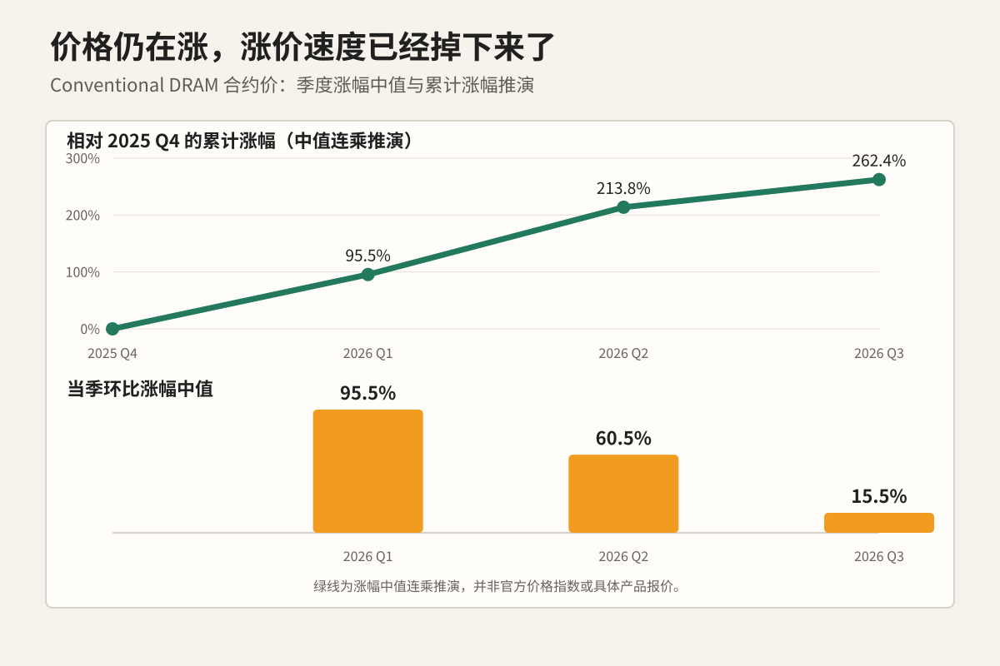
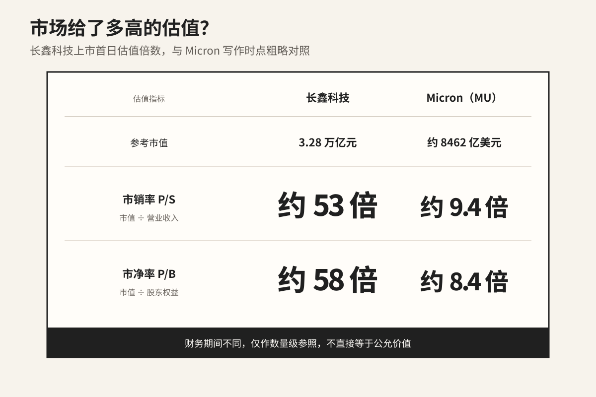
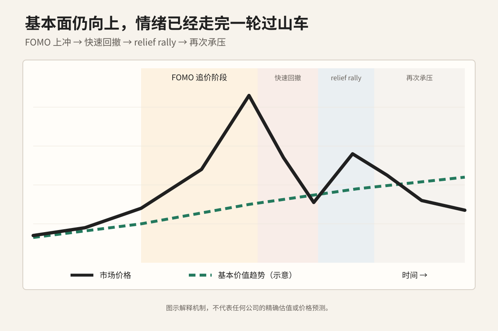
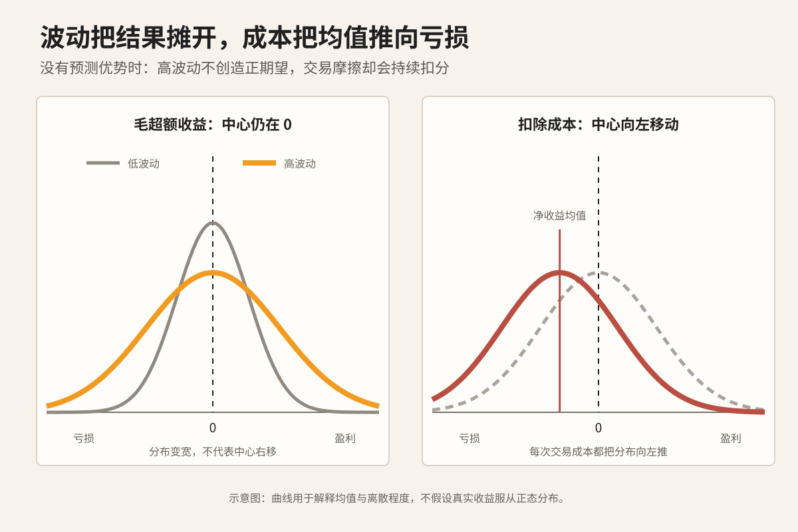

李嘉诚在 2008 年的一篇[公开专访](https://www.lksf.org/image/media/pdf/GE_interview.pdf)里回忆，股市最炽热的时候，曾有人愿意用 50、60 倍市盈率收购他的码头业务。他当然懂得买卖，却没有因为报价热闹就卖掉核心资产。

[财新对他的专访](https://www.lksf.org/caixin-interview-with-mr-li-ka-shing/?lang=zh)还回顾了另一段经历：房地产市场低迷时，他曾大举买入。

后来，人们把这套逆向思路概括成一句很好记的话：

> **买在无人问津处，卖在人声鼎沸时。**

逆向不等于逢跌就买。冷清可能因为资产很差，热闹也可能因为行业正在发生长期变化。这句话提醒我：**当一种投资逻辑已经人人会背，“基本面很好”就不够了。**

长鑫科技上市首日上涨 465.82% 以后，存储显然已经不在“无人问津处”。

DRAM 在涨价，HBM 仍然紧缺，AI 资本开支也没有停。这些逻辑都是真的，也已经家喻户晓。我更关心市场已经为它们付了多少钱。

关于 HBM、DRAM 和 NAND 的科普并不难找。这里我只回答一个问题：

> **存储的基本面明明还很好，我为什么不建议你现在买？**

## 先分清你买的到底是哪一种“存储”

“存储板块”这个名字装进了太多不同的生意。

[TrendForce 目前判断](https://www.trendforce.com/research/download/RP260727PO)，DRAM 供给在 2027 年仍可能偏紧；NAND 已经出现供给转松、下半年面临价格调整压力的迹象。产品不同，周期位置已经不同。

即使只看 DRAM，股票也要拆成三层：

1. **商品价格层：** 全球 DRAM 厂商面对的是同一轮供需和合约价周期；
2. **公司利润层：** 同一轮涨价进入不同公司的利润表时，方向和弹性并不相同；
3. **股票定价层：** 即使利润同时受益，两地市场提前计入的预期和给予的估值也可以完全不同。

Micron 向美国证券交易委员会（SEC）提交的 [2025 年 Form 10-K](https://www.sec.gov/Archives/edgar/data/723125/000072312525000028/mu-20250828.htm) 显示，公司直接制造并销售 DRAM、NAND 和 HBM。长鑫科技的[上交所正式招股说明书](https://static.sse.com.cn/disclosure/listedinfo/announcement/c/new/2026-07-22/688825_20260722_Q1T7.pdf)也表明，A 股现在同样有了直接研发、制造和销售 DRAM 的原厂。两家公司上市地点不同，DRAM 涨价都可以较直接地进入收入和毛利率。

但 A 股大量所谓“存储概念股”并不是原厂。模组厂先承受晶圆采购价变化，既可能获得库存收益，也可能被成本挤压；接口芯片公司更看服务器出货和 DDR 代际升级；设备、材料公司的订单则要等原厂资本开支传导。

同一轮上游涨价会经过不同公司的利润表，再由美股和 A 股给出各自的估值。上市地点只是标签，看一只具体股票要先问：

> **DRAM 涨价怎样进入这家公司的利润表？市场又提前付了多少价钱？**

接下来把范围收窄到 DRAM 原厂，从这条利润传导链的起点看起：DRAM 仍在涨价，涨幅却已经大幅回落。

## 基本面仍强，边际已经变了

TrendForce 连续三个季度给出的 conventional DRAM 合约价变化如下：

| 季度      | 环比涨幅区间                                                                     | 中值    |
| ------- | --------------------------------------------------------------------------: | -----: |
| 2026 Q1 | [93%–98%](https://www.trendforce.com/presscenter/news/20260601-13070.html) | 95.5% |
| 2026 Q2 | [58%–63%](https://www.trendforce.com/presscenter/news/20260601-13070.html) | 60.5% |
| 2026 Q3 | [13%–18%](https://www.trendforce.com/presscenter/news/20260703-13134.html) | 15.5% |

图里的橙色柱子是每个季度的涨幅中值。绿线则是我做的推演：把 2025 Q4 设为累计涨幅 0%，依次乘入三个季度的涨幅中值，得到约 95.5%、213.8% 和 262.4%。

绿线用于展示 **只要每个季度的涨幅仍为正，价格水平就会继续上升；但新增的涨幅已经越来越小**。

把 DRAM 的价格记作 $M_t$，季度涨幅就是：

$$
g_t = \frac{M_t}{M_{t-1}} - 1
$$

价格仍在上涨，意味着 $g_t>0$；涨价速度快速下降，意味着：

$$
\Delta g_t = g_t-g_{t-1}<0
$$

市场常把这种变化简称为“股票交易二阶导数”。这个说法并不严格。投资者并非机械地读取某个二阶导数，而是在判断未来盈利相对于原有预期会继续上修，还是开始下修。

DRAM 从“每季度涨近一倍”变成“每季度上涨一成多”，仍然是涨价。可是，如果市场此前按照涨价继续加速来估算未来毛利率，增速回落本身就足以触发盈利预测下修。

所以，**基本面还在改善，股价却可能先跌。**

## 十年的利润，几天就能写进股价

工厂要一座一座建，客户要一个一个拿，利润也只能一季一季兑现。资本市场重估未来，不需要等利润真的赚到手。

[现金流折现法](https://pages.stern.nyu.edu/~adamodar/New_Home_Page/lectures/val.html)最简化的写法是：

$$
P_t=\sum_{k=1}^{\infty}\frac{E_t(CF_{t+k})}{(1+r)^k}
$$

$P_t$ 是今天的估值，$CF_{t+k}$ 是未来第 $k$ 期能够归属于股东的现金流，$E_t(\cdot)$ 是市场站在今天对那笔现金流的估计，$r$ 是投资者要求的回报率。

假设一条新信息让市场相信，公司未来十年每年都能多赚一笔钱，投资者不会等十年后再逐年加价。他们会同时改写公式里未来十年的现金流预期，几天之内就可能完成重定价。

**业务需要十年兑现的故事，股价可以几天就付完。**

市场当然看不准十年以后，但它消化预期的速度远快于公司兑现利润的速度。DRAM 涨价、缺货和毛利率改善一旦成为共识，价格里已经包含了这些好消息，后续涨幅要靠盈利预测继续上修。

DRAM 价格、公司收入和毛利率可以同时改善，股票却照样下跌，因为新信息已经撑不起价格里那段昂贵的未来。

长鑫科技上市首日的定价，正好提供了一个极端样本。

## 3.28 万亿元，市场提前付了多少？

上市首日上涨 465.82%，不能单独证明长鑫科技被高估。科创板新股上市前五个交易日不设涨跌幅限制，发行价偏低也会制造夸张的首日涨幅。

收盘以后，市场递来了一张 3.28 万亿元的账单。

[长鑫上市首日](https://paper.cnstock.com/html/2026-07/28/content_2249077.htm)收盘市值达到 3.28 万亿元，换手率 66.40%，单日成交额 1411.87 亿元。对照[上交所正式招股说明书](https://static.sse.com.cn/disclosure/listedinfo/announcement/c/new/2026-07-22/688825_20260722_Q1T7.pdf)：

- 2025 年营业收入约 617.99 亿元；
- 2025 年末归属于母公司所有者权益约 567.54 亿元。

把市值分别除以这两个数字，可以得到两把粗略的估值尺子：

- **市销率（Price-to-Sales，P/S）约 53 倍**，即市值除以营业收入；
- **市净率（Price-to-Book，P/B）约 58 倍**，即市值除以归属于母公司股东的账面权益。

P/S 和 P/B 都不能脱离行业与盈利能力单独判断贵不贵。[Damodaran 对估值倍数的定义](https://pages.stern.nyu.edu/~adamodar/New_Home_Page/definitions.html)指出，市销率尤其受净利率影响，市净率则与净资产收益率密切相关。另一家 DRAM 原厂 Micron（MU）可以提供一个数量级参照。

截至本文写作时，[Micron 市值](https://www.nasdaq.com/market-activity/stocks/mu)约为 8462 亿美元。根据 Micron 向 SEC 提交的[最新 10-Q](https://www.sec.gov/Archives/edgar/data/723125/000072312526000015/mu-20260528.htm)，其近十二个月收入约 902.74 亿美元，最新股东权益约 1007.24 亿美元，对应的市销率约 **9.4 倍**、市净率约 **8.4 倍**。

长鑫和 Micron 的增长阶段、产品结构、资本结构都不相同。国产替代和上市稀缺性足以给长鑫带来一些“中国特色”的溢价，但这笔溢价最终仍要靠增长兑现。

这组数据还有时间口径上的错位：长鑫使用 2025 年全年数据，Micron 使用近十二个月收入和最新一期权益。2026 年一季度 DRAM 涨价极快，长鑫的收入规模已经发生变化；把高景气季度的增速直接线性外推，又会高估周期高点的可持续性。这张图只能帮助我们感受估值的数量级，不能直接推出公允价值。

3.28 万亿元给买入者设下了一道门槛：DRAM 高价、产能爬坡、市场份额和盈利能力要兑现到什么程度，又要维持多久？

> **好公司不等于好价格。3.28 万亿元要求长鑫持续跑赢最乐观的预期。**

如果买入理由只剩下“它还在涨”，我想你交易的不是标的本身，而是自己的**情绪**。

## 当基本面交易变成拥挤交易

高估值不会让行情当天结束。上涨带来的赚钱效应还会吸引资金，直到新增买盘撑不起已经打满的预期。

**FOMO** 指投资者害怕错过潜在收益，因而急于追入。[FINRA 的投资者教育材料](https://www.finra.org/investors/insights/pump-and-dump-scams)提到，价格上涨本身会放大这种情绪，吸引更多买盘。价格涨得越快，买入理由越容易缩成一句“再不上车就来不及”。殊不知，此时已经演化成了一场“击鼓传花”的游戏——你的买入缺乏逻辑，只是在赌未来有对手盘以更高的价格来接。

盈利预期停止上修以后，拥挤仓位开始松动。急跌期间如果坏消息没有继续恶化、卖盘暂时衰竭或者空头集中回补，价格可能出现短而快的反弹。[Interactive Brokers 对 **relief rally** 的定义](https://www.interactivebrokers.com/campus/glossary-terms/relief-rally/)正是：资产仍处于困难环境中，却因为压力缓解而暂时大幅上涨。

今年年初金银的抛物线上涨和回落，正好把这两段情绪放在同一张走势图上。存储和贵金属的基本面不同，但人在高波动中的反应很相似。

FOMO 容易把“别人正在赚钱”误认成买入依据；relief rally 容易把“最坏情况暂时没有发生”误认成趋势反转。即使基本面没有转坏，追价、止损和回补也可能接管短期波动。

## 没有优势时，波动只会放大成本

高波动会放大每次判断的结果，却不会自动提供方向上的优势。个人投资者如果无法预测下一段行情，又在 FOMO、暴跌和 relief rally 之间反复换向，交易成本会把原本接近零的毛期望拖成负数。

图中，高波动把结果摊得更开：大赚和大亏都更常见，平均值仍在零附近。每次换仓都要付出成本，扣除成本以后，整条净收益分布便向亏损一侧移动。

我们也可以展开更为严密的分析。

把你选择的多空仓位记作 $q$，下一段行情相对于被动持有的超额收益记作 $X$，换仓产生的全部成本记作 $C$，下单前已经掌握的信息记作 $I$。主动交易的条件期望可以简化成：

$$
E(\Pi\mid I)=qE(X\mid I)-E(C\mid I)
$$

仓位 $q$ 已经根据现有信息 $I$ 决定，所以可以从条件期望中提出；交易成本 $C$ 不会小于零。这种把预测收益与交易成本分开处理的框架，可参见 Stanford 的[多期交易模型](https://stanford.edu/~boyd/papers/cvx_portfolio.html)。

如果现有信息不能预测下一段超额收益，那么第一项最理想的情况也就是接近零（*相信我，你不会是那个天选之子*）：

$$
E(X\mid I)\approx0
\quad\Longrightarrow\quad
E(\Pi\mid I)\approx-E(C\mid I)<0
$$

**没有预测优势时，你承担了波动，留下了买卖价差、滑点、手续费和融资融券成本。**

高波动还会让止损更容易触发，扩大跳空与滑点，并让价格反复穿越交易信号，也就是人们常说的“追涨杀跌”。

方向换了无数次，预测能力没有提高，成本一分不少。

[上一篇文章](../expected-value-trade-frequency/index.md)讨论过交易次数怎样累计净期望。存储把同一个问题放进了更高波动、更拥挤的行情里。

频繁交易之外，还要算另一笔账：这项资产是否值得长期占用资金。

## 上涨，不等于值得占用资金

判断一种资产可能上涨，只是估计它的预期收益为正。是否值得买，还要看这份收益比无风险收益高出多少，以及差额能否补偿承担的风险。

这部分差额叫作 **风险溢价**。假设一种资产的预期收益是 10%，同期无风险收益是 4%，投资者真正因为承担风险而获得的预期补偿只有 6%。接下来还要继续问：

- 6% 是否足以补偿波动、回撤和估值收缩？
- 应该用多大仓位承担这份风险？
- 同样的资金是否有风险收益比更好的去处？

如果最乐观的盈利路径已经迅速写进股价，继续持有的潜在收益会下降，波动和估值回撤却不会一起消失。存储股最后即使上涨，等待时间、资金占用和中途风险也可能让这笔交易的资金利用率很低。

风险溢价、波动和潜在回撤构成这项资产的风险收益特征，仓位则是投资者评估以后作出的选择。缩小仓位可以控制判断错误时的账户损失，却不能让一笔风险溢价不足的交易变得更划算。

> 我会在以后单独成文讲述风险管理和仓位设计的问题。

对于存储，我的买入门槛很具体：估值充分回落；DRAM 涨价重新加速，并带动尚未计价的盈利上修；或者新的供给约束得到证实，却还没有成为市场共识。

在这些变化出现以前，我不需要猜它明天涨还是跌。**不买，本身就是一种交易。因为当前的预期收益还不足以占用这笔资金。**
